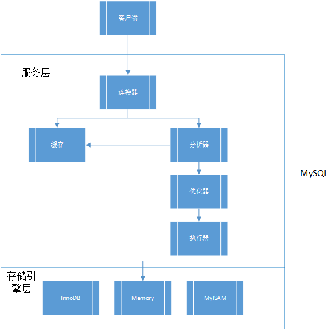
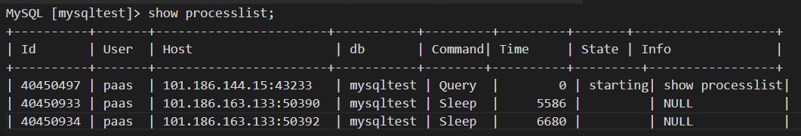

# 1 MySQL基础架构图

MySQL的逻辑架构可分为两个层：Server层和存储引擎层。

## 1.1 Server层
MySQL的Server层包括：链接器、缓存、分析器、优化器、执行器等，其功能为：
- MySQL的核心服务功能；
- 所有内置函数；
- 存储过程；
- 触发器；
- 视图。

### 1.1.1 链接器
链接器主要负责跟客户端建立链接、获取权限、维持和管理链接。客户端的链接命令为```mysql -h$ip -P$port -u$user -p```。链接步骤为：**客户端请求链接**=>**三次握手**=>**输入用户名名和密码**=>**查询权限**。

- 用户名或者密码验证**失败**：收到一个"ERROR 1045 (28000): Access denied for user 'XXXX'"的错误，然后链接中断，客户端执行结束。
- 查询权限：验证成功后，链接器会立即到权限表中查询链接用户的权限，然后把此权限信息保存到链接器里。
- 权限管理：链接一旦建立成功，则其权限将不再变更，哪怕使用管理权限进行了修改，只有新的链接才会生效。

#### 链接的管理
我们可以通过命令```show processlist;```查看数据库中所有的链接状态：

其中，Sleep状态的链接表明目前处于空闲状态，处于空闲状态的链接在经过一段时间后就会被链接器断开，时间由参数**wait_timeout**控制, 默认时间为**8小时**。

### 1.1.2 缓存
链接建立后就可以开始进行Sql语句查询。查询的第一步逻辑是查询缓存。但是请注意，缓存的使用要分清场景，一旦使用不当不但不会增加查询效率，反倒会消耗机器性能。缓存的失效非常的频繁，一旦表发生更新，则此表上的所有缓存都将失效。
**MySQL自从8.0版本开始完全删除了缓存模块。**

### 1.1.3 分析器
分析器负责对sql语句进行分析，包括词法分析和语法分析。

#### 1.1.3.1 词法分析
词法分析主要是分析你输入的查询语句，查询语句有字符和空格组成，词法分析就分析出你的这条语句的目的和意义。比如说```select * from table where id=1;```这条语句，词法分析讲得到以下结论：
- select： 表明这是一条查询语句
- *: 表示你要查询表里的所有字段
- table: 你要查询的表名称
- where：你查询的条件
- id：表的列

#### 1.1.3.2 语法分析
完成词法分析后，即可开始语法分析。语法分析的目的是判断你输入的sql语句语法上是否合法，若不合法，则会提示"You have an error in your SQL syntax"的错误。这种语法的错误十分好查好解决，一般关注紧跟"use near"的内容就是错误的原因所在。

### 1.1.4 优化器
在分析器进行分析之后，MySQL已经知道了你要做什么了，但是在最后执行语句之前，需要对语句进行优化。优化的方面有：
- 索引： 如果有多个索引，则优化器决定使用那个索引；
- join执行顺序： 如果语句有多表关联，则优化器决定先执行那个表
优化器对语句的执行结果不会产生影响，但是会对执行的效率产生影响。
执行完成优化器后，语句的执行方案就完全确定下来了，下面就直接进行执行并产生结果。

### 1.1.5 执行器
执行器对优化后的语句执行查询。但是首选需要查询用户权限，如果用户没有执行此操作的权限，则会提醒：SELECT command denied to user。
如果有权限，则会开始真正的执行，执行时调用的都是存储引擎接口。

## 1.2 存储引擎层
存储引擎层负责数据的存储和提取，MySQL采用了插件式的架构模式。常用的存储引擎插件有InnoDB，Memory，MyISAM等，自从MySQL5.5.5以来，默认使用InnoDB作为基础存储引擎。