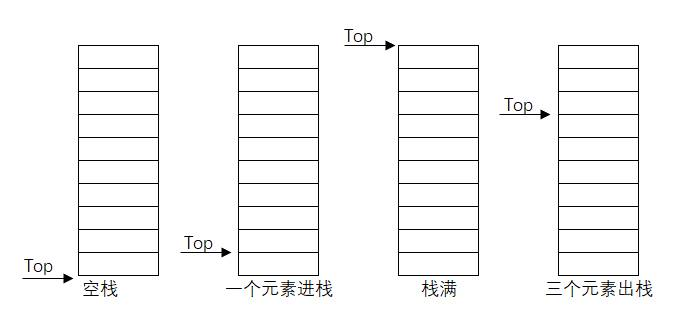

# 栈与队列

&emsp;&emsp;栈与队列，在数据结构中也属于线性表。

## 栈(Stack)
### 栈的实现逻辑
&emsp;&emsp;栈是一种特殊的表，其特殊在于插入与删除操作只能在末端（也就是栈顶）进行,因此栈是**后进先出(LIFO)**的线性表。栈的操作也就包含了出栈(Pop)，入栈(Push)和获取栈顶元素(Top)。

栈的实现方式有两种，一种是数组形式的栈(如下图)，另外一种是链表形式的栈。


### 栈的时间复杂度
|操作|时间复杂度|
|:-:|:-:|
|访问|O(n)|
|搜索|O(n)|
|插入|O(1)|
|删除|O(1)|

## 队列(Queue)
### 队列的实现逻辑
&emsp;&emsp;队列也是一种有特殊要求的线性表。队列要求只能在队列的**一端**进行插入操作，在**另一端**进行删除操作，因此队列是**先进先出(FIFO)**的线性表。
- 队头：允许删除的一端，称为对头；
- 队尾：允许插入的一端，称为队尾；
- 进队：向队伍插入元素，称为进队，新元素进队后成为新的队尾元素；
- 出队：向队伍删除元素，称为出队，元素出队后，其后继元素成为新的对头元素。

### 队列的时间复杂度
|操作|时间复杂度|
|:-:|:-:|
|访问|O(n)|
|搜索|O(n)|
|插入|O(1)|
|删除|O(1)|

## LeetCode相关题目
LeetCode题目 [有效的括号](https://leetcode-cn.com/problems/valid-parentheses/)：

题目内容：

给定一个只包括 '('，')'，'{'，'}'，'['，']' 的字符串，判断字符串是否有效。

有效字符串需满足：
1. 左括号必须用相同类型的右括号闭合。
2. 左括号必须以正确的顺序闭合。

注意空字符串可被认为是有效字符串。

这是一个考验栈操作的题目,java代码实现如下
```java
class Solution {
    public boolean isValid(String s) {
        if (s.isEmpty()) {
            return true;
        }

        Stack<Character> characters = new Stack<>();
        for (char ch : s.toCharArray()) {
            if (ch == ')'){
                char topCh = characters.empty() ? '-' : characters.pop();
                if(topCh != '('){
                    return false;
                }
            } else if (ch == '}'){
                char topCh = characters.empty() ? '-' : characters.pop();
                if(topCh != '{'){
                    return false;
                }
            } else if (ch == ']'){
                char topCh = characters.empty() ? '-' : characters.pop();
                if(topCh != '['){
                    return false;
                }
            } else {
                characters.push(ch);
            }
        }

        return characters.isEmpty();
    }
}
```